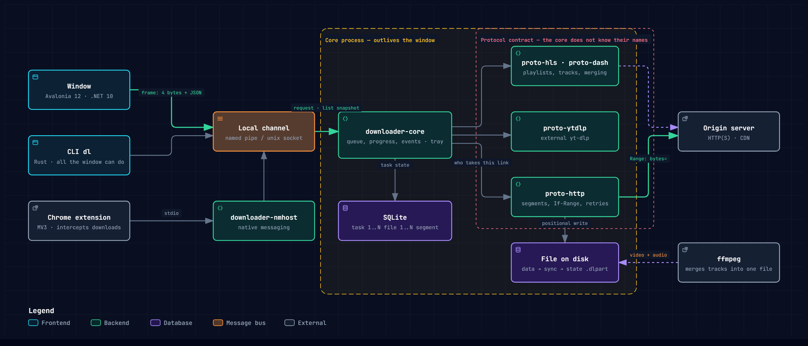

[Українська](README.md) · **English**

# Downloader

A download manager for Windows: segmented downloading with resume, HLS/DASH,
YouTube. In the vein of IDM and Ant Download Manager.



Interactive diagram: [open in a browser](https://riasj1dar.github.io/downloader/architecture.en.html)
(GitHub shows the file as code, not as a page). Source — `docs/architecture.en.json`.

## What it does

- **Segmented downloading** with dynamic splitting: a free worker takes
  **half of what is left** in the slowest segment, so one slow tail no longer
  holds up the whole task.
- **Resume after a broken connection** — and after the process is killed.
  The state file lives next to the data, and the write order is
  data → `sync` → state. The state therefore lags behind the data and never
  runs ahead of it.
- **HLS and DASH**: quality picked from the manifest, segments merged,
  separate audio tracks muxed into one file.
- **YouTube** through yt-dlp, quality selection included.
- **Browser extension**: intercepts downloads, shows a button on `<video>`,
  picks up `.m3u8` and `.mpd` from the page.
- **A queue** with speed limits, scheduling and a post-action (sleep,
  shutdown).
- **Interfaces**: an Avalonia window with a segment bar and a speed graph, a
  command line, Ukrainian and English.

## Installation

Two packages, differing only in ffmpeg:

| | size | when to take it |
|---|---|---|
| `Downloader-X.Y.Z-web.msi` | 43 MB | the usual case: `dl ffmpeg-install` fetches ffmpeg later |
| `Downloader-X.Y.Z-full.msi` | 95 MB | a machine with no network, or offline distribution |

Installs **per user**, into `%LOCALAPPDATA%\Programs\Downloader`, with no UAC
prompt and no service. The window ships .NET inside — no runtime to deliver.

⚠️ The packages are **not signed**: there is no code-signing certificate, so
SmartScreen will warn on first run. Instead, every release ships a
`SHA256SUMS.txt`, and the packages themselves are built in public CI from this
same source — so anyone can rebuild them and check the sums:

```
sha256sum -c SHA256SUMS.txt
```

### Why ffmpeg is needed

Without it YouTube does not download at all. Video and audio are served as
**separate tracks** — not even 144p exists as a single file — and nothing else
here can mux them. DASH likewise serves audio as its own stream.

The build used is the **LGPL** one, without `enable-gpl`. That is not a
detail: the GPL variant would oblige us to hand the source of the whole
program to everyone who receives it. LGPL carries no such requirement, and
ffmpeg here is not even linked into the code — it runs as a separate process.
Its licence ships alongside, in `LICENSE-ffmpeg.txt`.

## Command line

```
dl get https://example.com/file.zip -o file.zip
```

With the core in the tray, a task outlives the console:

```
downloader-core
dl add https://example.com/file.zip
dl variants https://cdn.example/master.m3u8
dl get https://cdn.example/master.m3u8 -o video.mp4 --variant 720p.ts
dl list
dl watch
```

Language: `dl --lang en …` or `DOWNLOADER_LANG=en`. The default is Ukrainian.

## Building

```
cargo build --workspace
cargo test --workspace
cargo clippy --workspace --all-targets
```

### Linux / macOS (experimental)

The core (`downloader-core`) and CLI (`dl`) build and run on Linux and macOS:
IPC uses a unix socket under `$XDG_RUNTIME_DIR` / Application Support (not a
world-writable `/tmp` path), data dirs follow XDG / Application Support, and
post-actions use systemctl / pmset.

Packaging (`.msi` / WiX), the Avalonia window and the tray stay Windows-first.
`downloader-nmhost --install` on Linux/macOS experimentally registers the
manifest under the standard `NativeMessagingHosts` directories (Chrome,
Chromium, Edge, Brave, Vivaldi, Firefox); `--uninstall` removes them.

```
cargo build -p downloader-cli -p downloader-core-service -p downloader-nmhost
./target/debug/downloader-core
./target/debug/dl add https://example.com/file.zip
./target/debug/downloader-nmhost --install
```

The window (.NET 10 SDK required):

```
dotnet build -c Release apps/ui
```

Installers (WiX 6 required — `dotnet tool install --global wix`):

```
pwsh -File packaging/zibraty.ps1 -Version 0.1.0
```

For the full package, put ffmpeg into `tools/ffmpeg-dist`.

## Layout

```
crates/core         engine, scheduler, protocol registry; knows nothing of the UI
crates/proto-http   segments, If-Range, retries
crates/proto-hls    playlists, tracks, decryption
crates/proto-dash   MPD: SegmentList and SegmentTemplate
crates/proto-ytdlp  YouTube through external yt-dlp
crates/ffmpeg       locating ffmpeg, remuxing, merging tracks
crates/ipc          local channel: named pipe / unix socket
crates/i18n         translation catalogues shared by every shell
apps/core-service   the core service: queue, events, tray
apps/cli            command line
apps/ui             Avalonia window
apps/nmhost         native messaging host for the extension
ext/chrome          browser extension
```

## The rules that hold the architecture together

1. **The core never names a protocol.** HTTP, HLS, DASH, torrent — all of it
   goes through the `Protocol` contract. A test with a dummy protocol proves
   it.
2. **Swallowing an error is forbidden.** `unwrap`, `expect`, `panic` and
   `let _ =` in the core are rejected by the build (`[lints.clippy]`).
3. **Logic does not creep into the UI.** Everything the window can do, the
   command line can do first.
4. **An error names the symptom.** Not «invalid state», but «the resource
   changed, resuming is impossible».
5. **The channel is local only.** A named pipe or a unix socket, never a TCP
   port — not even on `127.0.0.1`.

Comments, error messages and test names are written in Ukrainian; type,
function and field names in English, as is customary in Rust.

## Contributing

Open an issue first, then write code: a large change that does not fit the
project's intent will be turned down regardless of code quality.

Contributions are accepted with the
[Contributor Agreement](https://github.com/RiasJ1Dar/.github/blob/main/CLA.md)
accepted: you keep the copyright to your work, and the project gains the right
to release it under different terms. Without that, relicensing would be
impossible without permission from everyone who ever sent a patch. The rest of
the rules are in
[CONTRIBUTING](https://github.com/RiasJ1Dar/.github/blob/main/.github/CONTRIBUTING.md).

## Licence

[GNU General Public License v3.0 or later](LICENSE).

You are free to use the program, study it and share it. If you distribute a
modified version, the source of your changes must be open under the same
licence. This code cannot be turned into a closed product.

Third-party components — Rust and .NET libraries, ffmpeg, yt-dlp — belong to
their authors and come under their own licences: see
[THIRD-PARTY-NOTICES.txt](THIRD-PARTY-NOTICES.txt). None of them conflicts
with the GPL: they are all either permissive or MPL-2.0.
