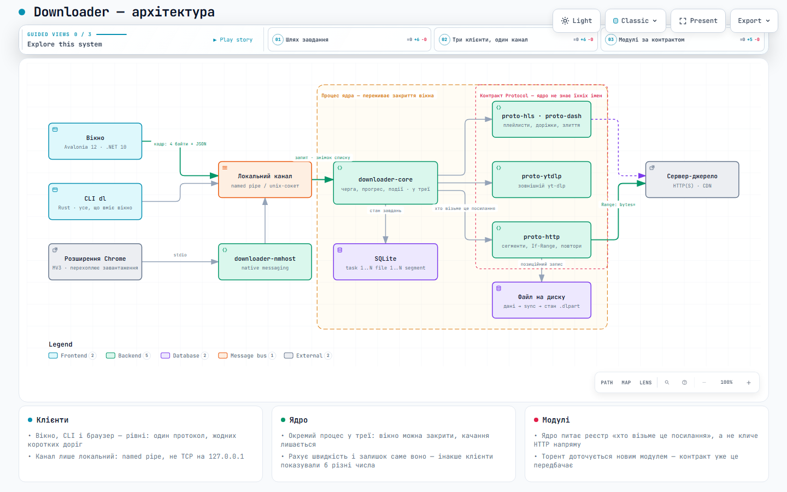

**Українська** · [English](README.en.md)

# Downloader

Менеджер завантажень для Windows (і експериментально Linux/macOS):
сегментоване качання з докачуванням, HLS/DASH, YouTube. Аналог IDM та
Ant Download Manager.



Інтерактивна схема: [відкрити в браузері](https://riasj1dar.github.io/downloader/architecture.html)
(на GitHub файл показує код, не сторінку). Джерело схеми — `docs/architecture.json`.

## Що вміє

- **Сегментоване качання** з динамічним поділом: вільний потік забирає
  половину залишку в найповільнішого, тож хвіст не тримає всю чергу.
- **Докачування після обриву** — і після вбивства процесу. Стан лежить
  поруч із файлом, а порядок запису такий: дані → `sync` → стан. Тому стан
  відстає від даних і ніколи їх не випереджає.
- **HLS і DASH**: вибір якості з маніфесту, злиття сегментів, окремі
  доріжки звуку зводяться в один файл.
- **YouTube** через yt-dlp, теж із вибором якості.
- **Розширення для браузера**: перехоплює завантаження, показує кнопку на
  `<video>`, підхоплює `.m3u8` і `.mpd` зі сторінки.
- **Черга** з лімітами швидкості, розкладом і післядією (сон, вимкнення).
- **Інтерфейс**: вікно на Avalonia зі смужкою сегментів і графіком
  швидкості, командний рядок, українська та англійська мови.

## Встановлення

Два пакети, різниця одна — ffmpeg:

| | розмір | коли брати |
|---|---|---|
| `Downloader-X.Y.Z-web.msi` | 43 МБ | звичайний випадок: ffmpeg довантажиться командою `dl ffmpeg-install` |
| `Downloader-X.Y.Z-full.msi` | 95 МБ | машина без мережі або роздача офлайн |

Ставиться **для користувача**, у `%LOCALAPPDATA%\Programs\Downloader`, без
UAC і без служби. Вікно йде з .NET усередині — доставляти рантайм не треба.

⚠️ Пакети **не підписані**: сертифіката підпису коду немає, тож SmartScreen
попереджатиме при першому запуску. Натомість до кожного випуску йде
`SHA256SUMS.txt`, а самі пакети збираються в публічному CI з цього ж коду —
тож зібрати їх самому й звірити суми може будь-хто:

```
sha256sum -c SHA256SUMS.txt
```

### Навіщо ffmpeg

Без нього YouTube не завантажується взагалі. Відео й звук роздаються
**окремими доріжками** — навіть 144p не існує одним файлом, — і звести їх
більше нічим. DASH так само віддає звук окремим потоком.

Береться **LGPL**-збірка, без ключа `enable-gpl`. Це не дрібниця: GPL-варіант
зобов'язав би відкрити вихідний код усієї програми кожному, кому її дали.
LGPL такої вимоги не має, а ffmpeg тут ще й не лінкується в код — він
запускається окремим процесом. Текст ліцензії їде поруч, у
`LICENSE-ffmpeg.txt`.

## Командний рядок

```
dl get https://example.com/file.zip -o file.zip
```

З ядром у треї завдання переживає закриття консолі:

```
downloader-core
dl add https://example.com/file.zip
dl variants https://cdn.example/master.m3u8
dl get https://cdn.example/master.m3u8 -o video.mp4 --variant 720p.ts
dl list
dl watch
```

Мова: `dl --lang en …` або `DOWNLOADER_LANG=en`. Типова — українська.

## Збірка

```
cargo build --workspace
cargo test --workspace
cargo clippy --workspace --all-targets
```

### Linux / macOS (experimental)

Повний стек (ядро + CLI + трей + Avalonia UI + nmhost) збирається на Linux і
macOS. MSI/WiX лишаються Windows-only; підписаних `.deb` / `.dmg` ще немає.

- **IPC:** `$XDG_RUNTIME_DIR/downloader/core.sock` (Linux) або
  `$HOME/Library/Application Support/Downloader/core.sock` (macOS) — не
  world-writable `/tmp/downloader-core.sock`.
- **Трей:** потрібна desktop-сесія. На Linux — `libgtk-3` +
  `libayatana-appindicator3` (або `libappindicator3`). Без `DISPLAY` ядро
  лише попереджає і далі обслуговує IPC (`cargo test` з `--pipe` трей
  пропускає).
- **nmhost:** `--install` / `--uninstall` → стандартні `NativeMessagingHosts`
  (Chrome, Chromium, Edge, Brave, Vivaldi, Firefox).

Збірка й запуск:

```
# Rust 1.90+
cargo build --release -p downloader-cli -p downloader-core-service -p downloader-nmhost

# UI (.NET 10 SDK)
dotnet publish -c Release apps/ui

# поставити в ~/.local/share/Downloader (+ .desktop, nmhost)
./packaging/install-unix.sh --user

# або вручну:
./target/release/downloader-core &          # трей + IPC
./target/release/dl add https://example.com/file.zip
dotnet run --project apps/ui -c Release    # або опублікований Downloader.Ui
./target/release/downloader-nmhost --install
./target/release/dl ffmpeg-install         # для YouTube / DASH
```

Залежності збірки трею (Debian/Ubuntu):

```
sudo apt install libgtk-3-dev libxdo-dev libayatana-appindicator3-dev pkg-config
```

Інсталятори (потрібен WiX 6 — `dotnet tool install --global wix`):

```
pwsh -File packaging/zibraty.ps1 -Version 0.1.0
```

Для повного пакета покладіть ffmpeg у `tools/ffmpeg-dist`.

## Структура

```
crates/core         рушій, планувальник, реєстр протоколів; про UI не знає
crates/proto-http   сегменти, If-Range, повтори
crates/proto-hls    плейлисти, доріжки, розшифрування
crates/proto-dash   MPD: SegmentList і SegmentTemplate
crates/proto-ytdlp  YouTube через зовнішній yt-dlp
crates/ffmpeg       пошук ffmpeg, зміна контейнера, зведення доріжок
crates/ipc          локальний канал: named pipe / unix-сокет
crates/i18n         каталоги перекладів, спільні для всіх оболонок
apps/core-service   ядро-сервіс: черга, події, трей
apps/cli            командний рядок
apps/ui             вікно на Avalonia
apps/nmhost         native messaging host для розширення
ext/chrome          розширення браузера
```

## Правила, які тримають архітектуру

1. **Ядро не згадує жодного протоколу на ім'я.** HTTP, HLS, DASH, торент —
   усе через контракт `Protocol`. Перевіряється тестом із
   протоколом-пустушкою.
2. **Проковтнута помилка заборонена.** `unwrap`, `expect`, `panic` і
   `let _ =` у ядрі відхиляє збірка (`[lints.clippy]`).
3. **Логіка не заповзає в UI.** Усе, що вміє вікно, спершу вміє командний
   рядок.
4. **Помилка називає симптом.** Не «invalid state», а «ресурс змінився,
   докачування неможливе».
5. **Канал лише локальний.** Named pipe або unix-сокет, без TCP-порту
   навіть на `127.0.0.1`.

Коментарі, тексти помилок і назви тестів — українською; назви типів,
функцій і полів — англійською, як заведено в Rust.

## Внески

Спершу issue, потім код: велика правка, яка не вписується в задум, буде
відхилена незалежно від якості коду.

Внески приймаються з прийнятою
[угодою контриб'ютора](https://github.com/RiasJ1Dar/.github/blob/main/CLA.md):
ви лишаєтесь автором свого коду, а проєкт отримує право випускати його під
різними умовами. Без цього змінити ліцензію було б неможливо без дозволу
кожного, хто колись надіслав патч. Решта правил — у
[CONTRIBUTING](https://github.com/RiasJ1Dar/.github/blob/main/.github/CONTRIBUTING.md).

## Ліцензія

[GNU General Public License v3.0 або новіша](LICENSE).

Програмою можна вільно користуватися, вивчати її й ділитися нею. Якщо ви
поширюєте змінену версію — вихідний код змін теж має бути відкритий під цією
самою ліцензією. Зробити з цього коду закритий продукт не вийде.

Сторонні компоненти — бібліотеки Rust і .NET, ffmpeg, yt-dlp — належать
їхнім авторам і йдуть під власними ліцензіями: див.
[THIRD-PARTY-NOTICES.txt](THIRD-PARTY-NOTICES.txt). Конфліктів із GPL серед
них немає: усі вони або пермісивні, або MPL-2.0.
